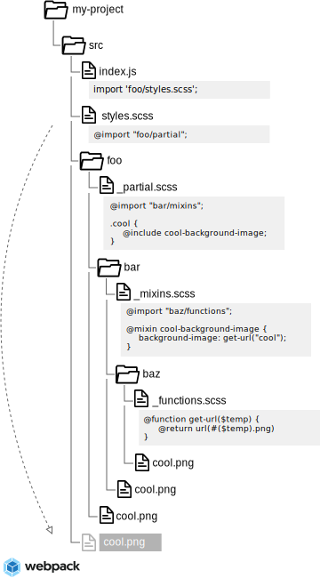

# How it works

## The problem

This loader is most commonly used with SASS but regardless of the transpiler we end up with CSS. Lets look at a basic example where the structure is basically CSS but is composed using SASS features.

Working backwards, this is the final CSS we are after. Just a single rule with a single declaration.

```css
.cool {
  background-image: url(cool.png);
}
```

When using SASS it's common for rules to come from different partials, and for declarations to be composed using mixins and functions. So let's carve up this CSS into different files to demonstrate that complexity.

[](detailed-problem.svg)

Now that we have more files we encounter a problem. As we [discussed earlier](../README.md) webpack expects asset paths to be relative to the root SASS file.

To solve this problem we need to re-write the `url()` asset path. But what should we rewrite it to?

All the subdirectories here contributed something to the declaration, we could reasonably place the asset in any of them. There could be a `cool.png` in _all the directories_! Which one should we use?

Actually its worse than that. Webpack doesn't know any of these nested SCSS files went into the SASS composition, it only knows about the root SASS file. It doesn't know there _are_ nested directories. How do we rewite to something we don't know about?

To rewrite the url we will first we will need a list of these contributing directectories and next look for the asset in those directories. So how do we get that list from SASS post factum, while working from within webpack? 😫

## The solution

Sourcemaps! 😃

Wait.. don't run away.. sure sourcemaps can be scarey but they solve our problem reasonably well. 👍

The SASS compiler source-map can tell us which original SCSS file contributed each character in the resulting CSS.

The SASS source-map is also something we can access from within Webpack.

### concept

Working with the example above let's simply compile SASS on the command line.

You can do this several different ways but personally I prefer [npx](https://blog.npmjs.org/post/162869356040/introducing-npx-an-npm-package-runner) since I always have `npm` available.

```sh
> npx node-sass src/styles.scss --output . --output-style expanded --source-map true
```

Using the experimental `sourcemap-to-string` package we can visualise the SASS source on the left vs the output CSS on the right.

```
src/styles.scss                                                                
-------------------------------------------------------------------------------
                                                                               
src/foo/_partial.scss                                                          
-------------------------------------------------------------------------------
3:01 .cool░░░░░░░░░░░░░░░░░░░░░░░░░░░░░ 1:01 .cool░░░░░░░░░░░░░░░░░░░░░░░░░░░░░
3:06 ░░░░░ ░░░░░░░░░░░░░░░░░░░░░░░░░░░░ 1:06 ░░░░░ ░░░░░░░░░░░░░░░░░░░░░░░░░░░░
3:07 ░░░░░░{⏎                           1:07 ░░░░░░{⏎                          
       @include cool-background-image;⏎        ░░░░░░░░░░░░░░░░░░░░░░░░░░░░░░░░
     }░░░░░░░░░░░░░░░░░░░░░░░░░░░░░░░░░      ░░░░░░░░░░░░░░░░░░░░░░░░░░░░░░░░░░
-:-- ░░░░░░░░░░░░░░░░░░░░░░░░░░░░░░░░░░ 3:02 ░⏎                                
     ░░░░░░░░░░░░░░░░░░░░░░░░░░░░░░░░░░      ⏎                                 
     ░░░░░░░░░░░░░░░░░░░░░░░░░░░░░░░░░░      /*# sourceMappingURL=styles.css.ma
     ░░░░░░░░░░░░░░░░░░░░░░░░░░░░░░░░░░      p */░░░░░░░░░░░░░░░░░░░░░░░░░░░░░░
                                                                               
src/foo/bar/_mixins.scss                                                       
-------------------------------------------------------------------------------
4:03 ░░background-image░░░░░░░░░░░░░░░░ 2:03 ░░background-image░░░░░░░░░░░░░░░░
4:19 ░░░░░░░░░░░░░░░░░░: get-url("cool" 2:19 ░░░░░░░░░░░░░░░░░░: ░░░░░░░░░░░░░░
     );⏎                                     ░░░░░░░░░░░░░░░░░░░░░░░░░░░░░░░░░░
     }⏎                                      ░░░░░░░░░░░░░░░░░░░░░░░░░░░░░░░░░░
                                                                               
src/foo/bar/baz/_functions.scss                                                
-------------------------------------------------------------------------------
2:11 ░░░░░░░░░░url(#░░░░░░░░░░░░░░░░░░░ 2:21 ░░░░░░░░░░░░░░░░░░░░url(cool.png)░
2:16 ░░░░░░░░░░░░░░░{$temp}.png);⏎      2:34 ░░░░░░░░░░░░░░░░░░░░░░░░░░░░░░░░░;
     }░░░░░░░░░░░░░░░░░░░░░░░░░░░░░░░░░      ⏎                                 
     ░░░░░░░░░░░░░░░░░░░░░░░░░░░░░░░░░░      }░░░░░░░░░░░░░░░░░░░░░░░░░░░░░░░░░
```

As expected, the pure CSS portions are essentially the same in the source and the output.

Meanwhile the indirect  `@mixin` and `funtion` substitutes values into the output. But we can still clearly see where in the source that final value originated from.

### algorithm

Now we know the original SCSS sources we can use a CSS parser such as `postcss` to process all the declaration values that contain `url()` and rewrite any file paths we find there.

1. Enumerate all declaration values
2. Split the value into path substrings
3. Evaluate the source-map at that location, find the original source file
4. Rebase the path to that original source file.

For our example, this algorithm will always give us the asset located in the `baz` subdirectory. Clearly evaluating the source-map at just one location is not enough. Any of the directories that contributed source files to the rule-set might be considered the "correct" place to store the asset and all these files contributed different parts of the rule-set, not just the declaration value.

We stop short of evaluating the source-map for _every characer_ in the rule-set and instead we chose a small number of meaningful points.

|   | label     | sampling location                        | in the example            | implies asset                                    |
|---|-----------|------------------------------------------|---------------------------|--------------------------------------------------|
| 1 | subString | start of **argument** to the `url()`     | `c` in `cool.png`         | `src/foo/bar/baz/cool.png` |
| 2 | value     | start of **value** in the declaration    | `u` in `url(...)`         | `src/foo/bar/baz/cool.png` |
| 3 | property  | start of **property** in the declaration | `b` in `background-image` | `src/foo/bar/cool.png`                            |
| 4 | selector  | start of **selector** in the rule-set    | `.` in `.selector`        | `src/foo/cool.png`                                |

These locations are tested in order. If an asset of the correct filename is found then we break and use that result.

Note it is a quirk of the example that the `value` and `subString` locations imply the same file. In a more complex example this may not be true.

If necessary the order can be customised or a custom file search (starting at each location) be implemented. Refer to the [advanced features](advanced-features.md).


### webpack

A caveat is that we need a Webpack configuration where we _definitely_ get a sourcemap from upstream SASS loader. All the time, not just when `devtool` is used.

We therefore need to explicitly configure the `sass-loader` for `sourceMap`. The transpiler will then output both **CSS** and **source-map** that we can use downstream, in all developement and production builds. We can then place our algorithm as next loader in line, after the transpiler.

```javascript
{
  test: /\.scss$/,
  use: [
    {
      loader: 'resolve-url-loader'  // <-- receives CSS and source-map
    }, {
      loader: 'sass-loader',
      options: {
        sourceMap: true,  // <-- IMPORTANT!
        sourceMapContents: false
      }
    }
  ]
}
```

As a Webpack loader we have full access to the loader API and the virtual file-system. This means maximum compatibility with `webpack-dev-server`.

It's plausable the algorithm _could_ be realised as a `postcss` plugin in isolation, using the [root.input.map](https://postcss.org/api/#postcss-input) property, and be combined with other plugins in a single `postcss-loader` step. Processing multiple plugins together in this way without reparsing would arguably be more efficient at the expense of compatibility. However for now the implementation is limited to the webpack loader.